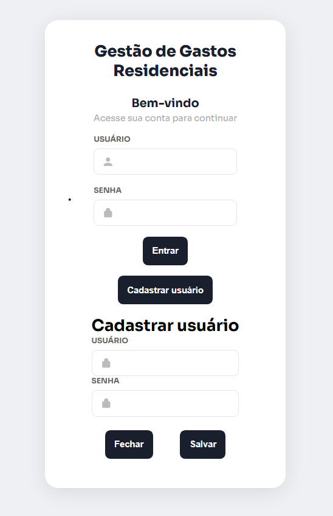
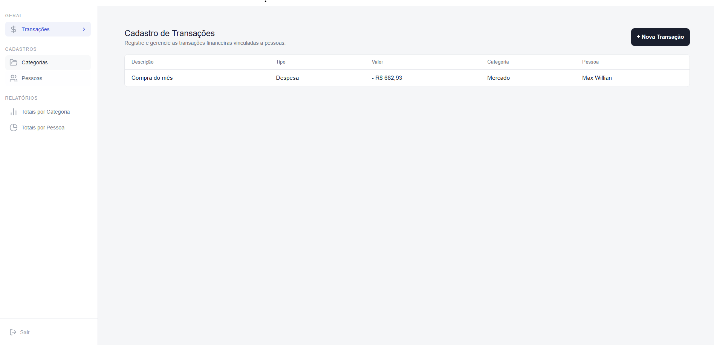
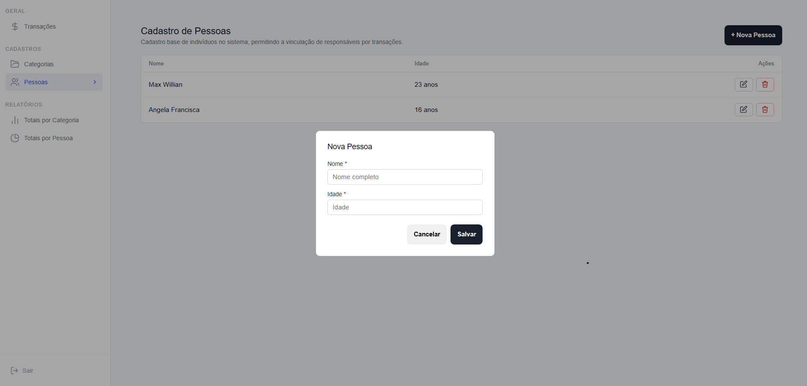
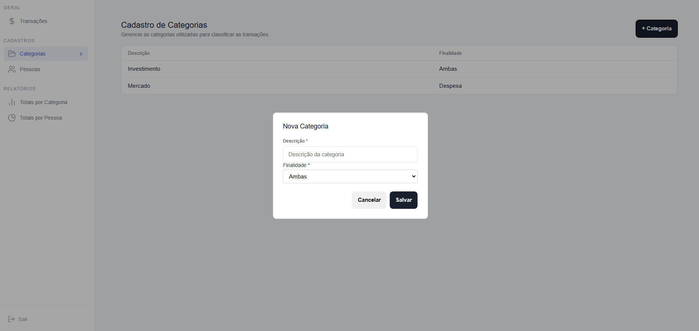
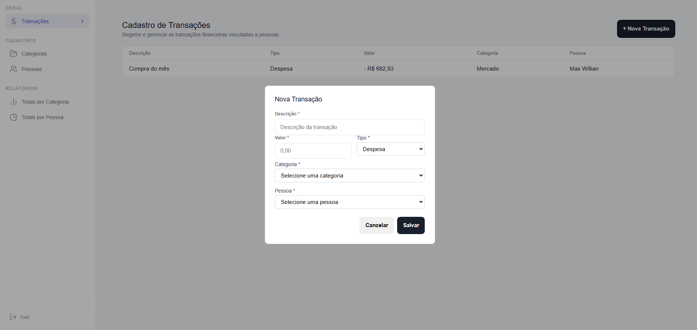
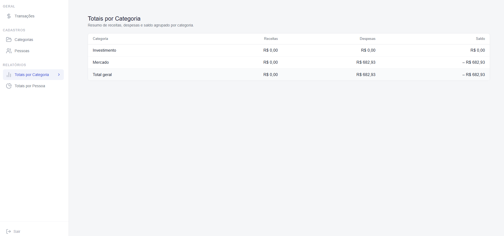
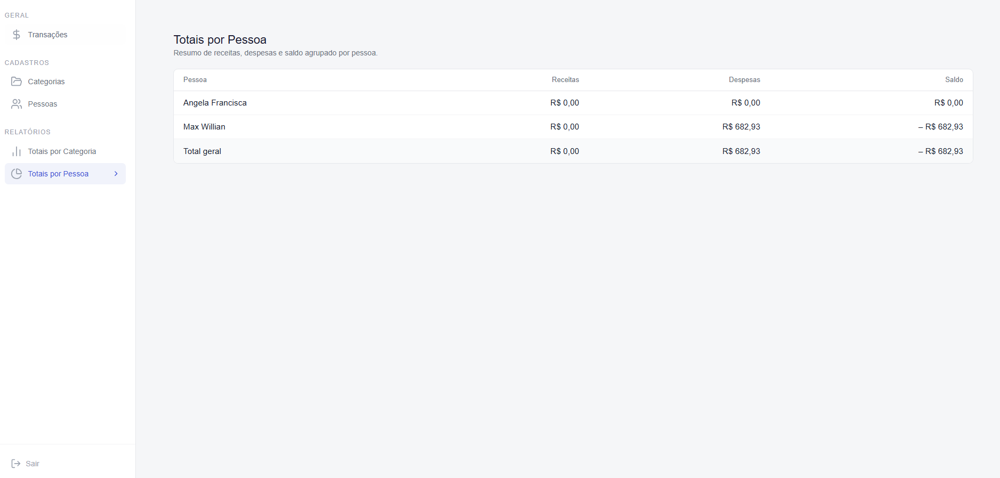

# Gestão de Gastos Residenciais

O **Gestão de Gastos Residenciais** é uma aplicação desenvolvida para organizar e controlar as finanças do dia a dia. O sistema permite registrar transações, gerenciar categorias financeiras e acompanhar os gastos e receitas dos moradores, oferecendo uma visão consolidada dos dados.

A solução foi estruturada com separação clara entre **Backend (API)** e **Frontend (Interface)**, garantindo organização, escalabilidade e facilidade de manutenção.

---

## 🎯 Funcionalidades e Regras de Negócio

### 👤 Pessoas
- Cadastro completo: criação, edição, exclusão e listagem.

**Regras:**
- ID gerado automaticamente.
- Nome com até 200 caracteres.
- Idade obrigatória no cadastro.
- Ao excluir uma pessoa, todas as suas transações também são removidas (exclusão em cascata).

---

### 🏷️ Categorias
- Cadastro e listagem de categorias financeiras.

**Regras:**
- ID automático.
- Descrição com até 400 caracteres.
- Tipo da categoria:
  - Despesa
  - Receita
  - Ambas

---

### 💸 Transações
- Registro e consulta de movimentações financeiras.

**Regras:**
- ID gerado automaticamente.
- Descrição com até 400 caracteres.
- Valor deve ser **maior que zero**.
- Tipo obrigatório: *Despesa* ou *Receita*.
- Toda transação deve estar vinculada a uma pessoa.

#### ⚠️ Regras Importantes
- **Menores de idade (< 18 anos):**
  - Podem registrar apenas **Despesas**.
  - Tentativas de registrar **Receitas** são bloqueadas.

- **Validação de Categoria:**
  - A categoria deve ser compatível com o tipo da transação.
  - Exemplo: não é permitido usar uma categoria de *Receita* em uma *Despesa*.

---

## 📊 Relatórios

### 1️⃣ Saldo por Pessoa
Apresenta um resumo financeiro individual:
- Total de Receitas
- Total de Despesas
- **Saldo final**

Inclui também um total geral consolidado.

---

### 2️⃣ Saldo por Categoria
Resumo financeiro agrupado por categoria:
- Total de Receitas
- Total de Despesas
- **Saldo por categoria**

Inclui total geral consolidado.

---

## 🚀 Tecnologias Utilizadas

### Backend
- .NET / C#
- API REST
- Arquitetura baseada em **DDD** e **Clean Architecture**

### Frontend
- React
- TypeScript
- Vite

### Banco de Dados
- SQL Server

---

## 💻 Como Executar o Projeto

### 1. Banco de Dados (Via Docker)

Primeiro, tenha o aplicativo Docker Desktop ativado e rodando. 

Na sua ferramenta de terminal de preferência (Prompt de comando PowerShell, bash, etc.), insira o comando abaixo e aguarde sua instalação remota:

```bash
docker run -e "ACCEPT_EULA=Y" -e "MSSQL_SA_PASSWORD=@Admin123" -p 1433:1433 --name sqlserver -d mcr.microsoft.com/mssql/server:2022-latest
```

---

## 📸 Passo a Passo de Utilização

Abaixo, apresentamos o fluxo visual da nossa aplicação, detalhando como interagir com as telas principais.

### 1️⃣ Autenticação e Cadastro Inicial
Ao acessar o sistema, você encontrará a tela de **Login**. Nela, é possível inserir suas credenciais de acesso ou, caso ainda não tenha uma conta, clicar em "Cadastrar usuário" para abrir diretamente o formulário de registro na mesma tela.



### 2️⃣ Dashboard e Tela Inicial
Uma vez logado, a tela inicial fornece uma visão limpa e direta da aplicação, permitindo acesso rápido aos cadastros (Categorias e Pessoas) e aos relatórios de consolidação financeira pelo menu lateral.



### 3️⃣ Cadastramento de Pessoas
Acesse o menu `Pessoas` para gerenciar os membros da residência. Clicando no botão escuro **+ Nova Pessoa**, um modal simples pedirá apenas o Nome e a Idade para que o integrante possa receber transações.



### 4️⃣ Cadastramento de Categorias
Acesse `Categorias` no menu lateral para gerenciar os tipos de agrupamentos financeiros (ex: Investimentos, Alimentação). Ao clicar em **+ Categoria**, o modal permitirá que você preencha a descrição e selecione a finalidade correta num formulário ágil.



### 5️⃣ Lançamento de Transações
O verdadeiro núcleo de gestão da casa. Ao clicar em **+ Nova Transação**, selecione o integrante, o montante, e direcione para uma das suas categorias com o respectivo tipo.



### 6️⃣ Relatório de Totais por Categoria
O painel reúne todas as transações nos grupos de Categorias criados. Você monitora visualmente a Receita, a Despesa e o Saldo Consolidado final de cada agrupamento, além de um somatório geral unificado abaixo.



### 7️⃣ Relatório de Totais por Pessoa
Esse relatório proporciona a visibilidade contábil e de gastos individual. Você avalia, de forma tabular, quanto cada integrante repassou em Receitas, o quanto processou de Despesas e qual o seu Saldo particular. O agregado geral macro demonstrará a constatação final da saúde financeira da casa.



---

## 🗄️ Estruturas de Banco de Dados (SQL Scripts)

Caso deseje criar o banco de dados e as tabelas manualmente ou validar a modelagem relacional, aqui estão os *scripts* SQL de Criação das Entidades do nosso sistema:

```sql
CREATE TABLE Usuario (
    Id INT PRIMARY KEY,
    Username VARCHAR(100) NOT NULL,
    SenhaHash VARCHAR(255) NOT NULL
);

CREATE TABLE Pessoa (
    Id INT PRIMARY KEY,
    Nome VARCHAR(150) NOT NULL,
    DataNascimento DATE NULL
);

CREATE TABLE Categoria (
    Id INT PRIMARY KEY,
    Descricao VARCHAR(150) NOT NULL,
    Finalidade TINYINT NOT NULL
);

CREATE TABLE Transacao (
    Id INT PRIMARY KEY,
    Descricao VARCHAR(200) NOT NULL,
    Valor DECIMAL(18,2) NOT NULL,
    Tipo TINYINT NOT NULL,
    DataTransacao DATETIME NOT NULL DEFAULT GETDATE(),
    CategoriaId INT NOT NULL,
    PessoaId INT NOT NULL,

    CONSTRAINT FK_TransacaoCategoria FOREIGN KEY (CategoriaId) REFERENCES Categoria(Id),
    CONSTRAINT FK_TransacaoPessoa FOREIGN KEY (PessoaId) REFERENCES Pessoa(Id)
);

CREATE INDEX IX_TransacaoCategoriaId ON Transacao(CategoriaId);
CREATE INDEX IX_TransacaoPessoaId ON Transacao(PessoaId);
```